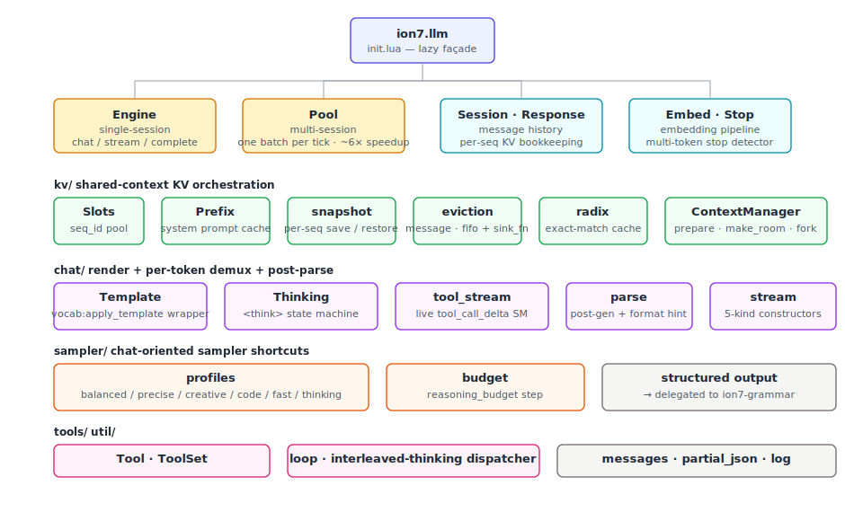
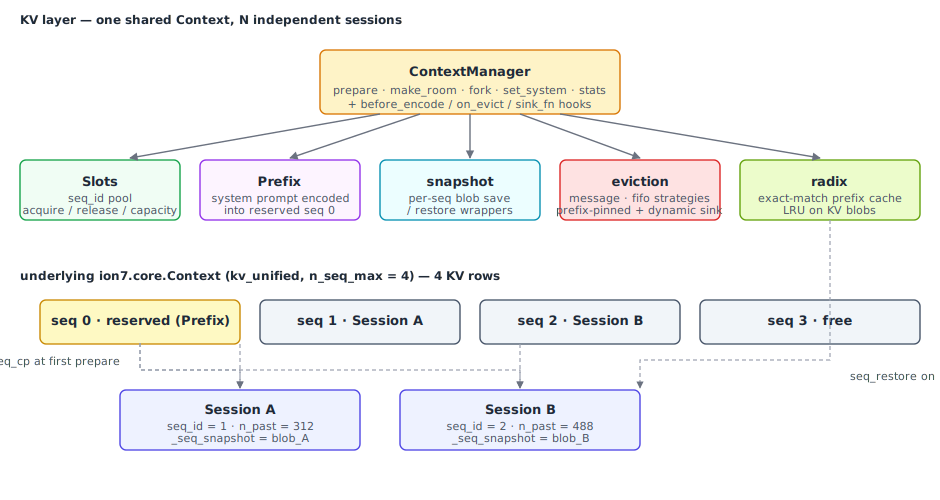
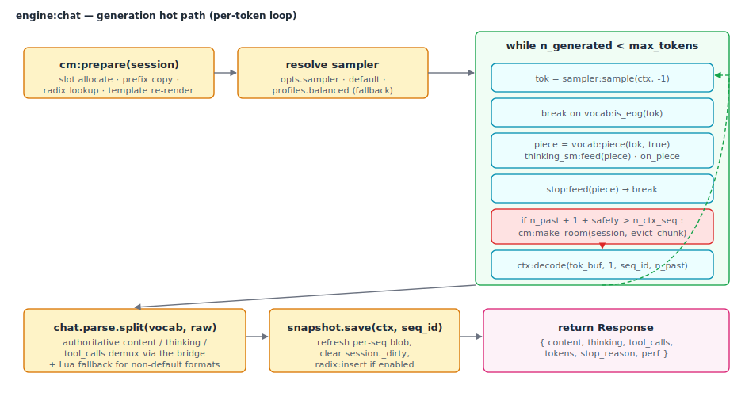
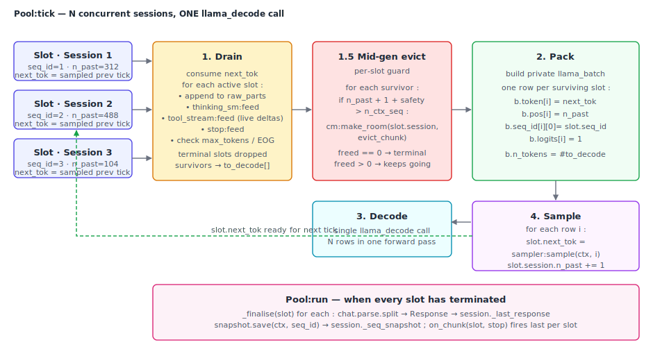
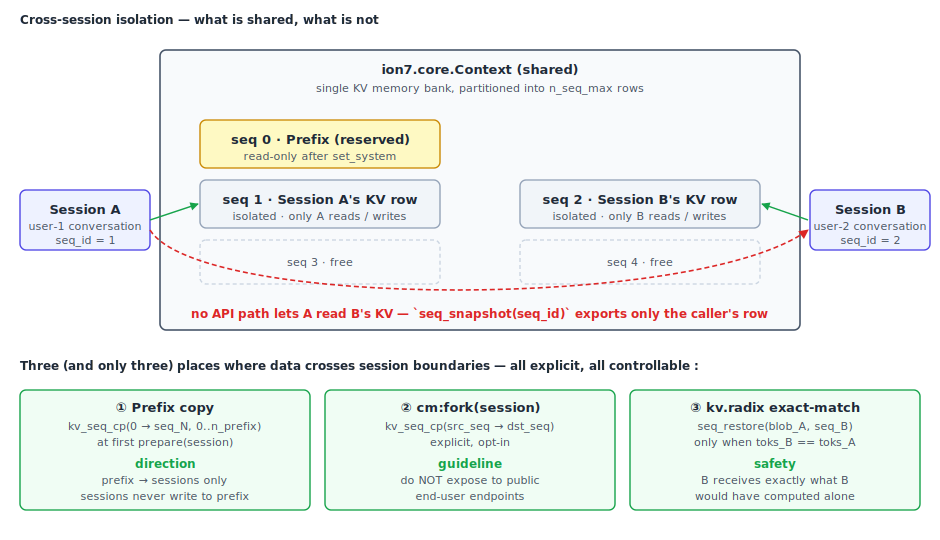

# ion7-llm architecture

A walkthrough of the technical decisions behind ion7-llm, aimed at
contributors and curious users. The user-facing API surface is in
[`README.md`](README.md) ; this document covers the **why** and the
**how** of the chat pipeline, the multi-session orchestrator, the KV
layer, and the way ion7-llm cooperates with ion7-core.

---

## 1. Layered overview

<p align="center">
  
</p>

Three tiers, top to bottom :

1. **Your Lua application.** Anything from a 30-line CLI prompt to a
   long-running agent loop. ion7-llm is meant to be embedded — it
   exposes data classes and orchestration objects, never long-running
   server processes.

2. **`ion7.llm` — the chat pipeline.** Pure Lua. Owns four families :
   - **Data** : `Session`, `Response` — value objects that flow between
     turns. No FFI, no stateful side-effects beyond their own fields.
   - **Orchestration** : `Engine` (single-session), `Pool`
     (multi-session), `kv.ContextManager` (slot pool, prefix cache,
     eviction).
   - **Demultiplexing** : `chat.thinking` (per-token `<think>...</think>`
     state machine), `chat.parse` (post-generation tool-call + reasoning
     extraction via the bridge), `chat.stream` (typed-chunk constructors).
   - **Sampling and tools** : `sampler.profiles` / `sampler.schema` /
     `sampler.budget`, plus declarative `tools.Tool` / `tools.ToolSet`
     and the `tools.loop` dispatcher.

3. **`ion7.core` — silicon.** The lower-level runtime ion7-llm builds
   on. ion7-llm calls into `Model`, `Vocab`, `Context`, `Sampler` for
   every primitive ; it does NOT re-implement any of those. The
   bundled libraries (`ion7.vendor.json`, etc.) are also picked up
   from ion7-core, so a downstream consumer never has to install
   `dkjson` or `cjson` separately.

The split lets ion7-core stay a verbatim wrapper of `llama.cpp` (one
that gets regenerated on every upstream bump) while ion7-llm captures
the higher-level patterns that don't belong in a binding library —
session bookkeeping, multi-tenant KV management, structured output,
chat template UX.

---

## 2. Module organisation

<p align="center">
  
</p>

The source tree mirrors the orchestration layers :

```
src/ion7/llm/
├── init.lua            -- lazy façade with class registry + sub-namespaces
├── session.lua         -- conversation history + per-seq KV bookkeeping
├── response.lua        -- value object emitted by every chat / stream call
├── engine.lua          -- single-session pipeline (chat / stream / complete)
├── pool.lua            -- multi-session pipeline (one batch per tick)
├── stop.lua            -- multi-token stop-string detector
├── embed.lua           -- dedicated embedding pipeline
├── kv/                 -- KV layer
│   ├── slots.lua       --   sequence-id allocator over ctx:n_seq_max()
│   ├── prefix.lua      --   system-prompt prefill cached in seq 0
│   ├── snapshot.lua    --   per-seq save / restore wrappers
│   ├── eviction.lua    --   "message" / "fifo" overflow strategies
│   └── init.lua        --   ContextManager — orchestrates the four above
├── chat/               -- chat-template + demux helpers
│   ├── template.lua    --   render via vocab:apply_template
│   ├── thinking.lua    --   per-token <think> state machine
│   ├── parse.lua       --   post-generation tool / reasoning extraction
│   └── stream.lua      --   typed-chunk constructors + collect helper
├── sampler/            -- chat-oriented sampler shortcuts
│   ├── profiles.lua    --   balanced / precise / creative / code / fast / thinking
│   ├── schema.lua      --   JSON Schema → GBNF → grammar sampler
│   └── budget.lua      --   reasoning-budget step prepend
├── tools/              -- declarative tools + dispatch loop
│   ├── spec.lua        --   Tool / ToolSet
│   └── loop.lua        --   interleaved-thinking-aware dispatcher
└── util/
    ├── messages.lua    --   role validation + builder helpers
    ├── partial_json.lua--   streaming JSON accumulator
    └── log.lua         --   thin wrapper that mirrors ion7.core.util.log
```

Two patterns recur across the tree :

**Lazy façade.** `init.lua` exposes `llm.Engine`, `llm.Pool`,
`llm.Session`, plus four sub-namespaces (`llm.chat`, `llm.sampler`,
`llm.tools`, `llm.kv`). Each is pulled in via a `__index` metatable
hook on first access — a script that only uses `llm.Embed` never pays
the load cost of `llm.Pool`.

**Pure-data classes.** `Session` and `Response` are intentionally
inert : they store fields, expose helpers, and hand themselves to the
engine for processing. Any logic that touches the model lives in
`engine.lua` / `pool.lua` / `kv/`. The split keeps the test suite
neat — most of `Session` is testable without a model.

---

## 3. The KV layer

<p align="center">
  
</p>

The KV layer is the value-add over a naive "one context per
conversation" approach. Four collaborating modules :

- **`Slots`** — pure pool of seq_ids over `[0, n_seq_max - 1]`. A
  reserved slot can be excluded from rotation (this is how the prefix
  cache pins seq 0 for itself). Acquire / release / capacity.

- **`Prefix`** — system-prompt prefill, cached in the reserved slot.
  When the context can fit `n_seq_max ≥ 2`, the system message is
  encoded ONCE into seq 0, then `kv_seq_cp`'d onto each user session
  on first prepare. Below that capacity (single-seq context), the
  prefix degrades to text-only mode and the system message is
  prepended on every render — still correct, just slower.

- **`snapshot`** — thin wrappers around `Context:seq_snapshot` /
  `Context:seq_restore`. Per-seq, never whole-context — restoring a
  blob into seq 2 must not disturb seqs 0, 1, 3.

- **`eviction`** — when `session.n_past + new_tokens + headroom`
  exceeds `n_ctx_seq`, drop old tokens. Two strategies :
  - `"message"` (default) walks `_msg_kv_ends` to evict whole
    messages from the head, so the model never sees a half-message.
  - `"fifo"` is a token-aligned ring buffer ; cheaper to compute, may
    cut a message in half.
  Both honour `prefix_n` (pinned at the start) and `n_sink`
  (StreamingLLM-style attention sink, default 4 tokens).

These four ride above `ContextManager` (`kv/init.lua`), which is what
the engine actually talks to. Its `prepare(session)` method is the
hot path for every chat call ; six ordered steps :

1. **Allocate a slot** if the session does not have one.
2. **Fast path** : if the session is clean (`!_dirty`) and has a
   snapshot blob, restore via `seq_restore`. n_past is taken from the
   blob ; no decode runs.
3. **Slow path** : `kv_seq_rm` the row, `kv_seq_cp` the prefix in
   (when present), render the rest of the history through the chat
   template, tokenise.
4. **Overflow check** : if `session.n_past + n + headroom > n_ctx`,
   call the active eviction strategy. The `on_evict` hook can
   substitute a summarisation message for the dropped block.
5. **Decode** the suffix at `(seq_id, session.n_past)`. Per-message KV
   ends are recorded for the next eviction round.
6. **Snapshot** the seq via `seq_snapshot` and store the blob on the
   session for the next call's fast path.

Two hooks let the consumer customise without forking : `before_encode`
runs just before tokenisation (RAG injection, history compression),
`on_evict` fires when eviction drops messages.

---

## 4. The hot path

<p align="center">
  
</p>

The per-token loop in `engine.lua` is intentionally tight :

```lua
while n_generated < max_tokens do
    local tok = sampler_sample(sampler, ctx_ptr, -1)
    if vocab_is_eog(vocab, tok) then break end

    local piece = vocab_piece(vocab, tok, true)
    raw_parts[#raw_parts + 1] = piece
    if on_piece then on_piece(piece, thinking_sm) end

    if stop:feed(piece) then break end

    -- Mid-generation eviction guard.
    if session.n_past + 1 + mid_safe > n_ctx_seq then
        if cm:make_room(session, mid_chunk) == 0 then break end
    end

    tok_buf[0] = tok
    ctx_decode(ctx, tok_buf, 1, seq_id, session.n_past)
    session.n_past = session.n_past + 1
    n_generated    = n_generated   + 1
end
```

A few non-obvious choices :

- **Pre-allocated `int32_t[1]`.** Allocated once at `Engine.new` and
  reused on every iteration. The decode entry point of ion7-core
  accepts `cdata` directly, so no per-token Lua-table → cdata
  conversion is needed.

- **Hot-path locals.** `sampler.sample`, `vocab.is_eog`, `vocab.piece`,
  `ctx.decode`, `coroutine.yield`, `Stream.content / thinking / stop`
  are all cached as upvalues at module load time. LuaJIT can compile
  to direct function references instead of a metatable lookup per
  iteration.

- **No `pcall` in the hot path.** Earlier drafts wrapped `ctx:decode`
  in `pcall` to catch a `KV cache full` error mid-generation. `pcall`
  blocks LuaJIT's trace compiler ; we replaced the fallback with the
  preventive `cm:make_room` check above, which keeps the loop
  trace-able and lets sessions generate past `n_ctx` instead of
  dying with a `length` cut.

- **Explicit `seq_id` + `pos_offset`.** Every `ctx:decode` call
  passes both arguments. The context's Lua-side `_n_past` mirror is
  intentionally NOT touched — it would alias across sessions sharing
  the same context, and the multi-session correctness story collapses
  if it does.

- **Demux happens on `piece`, not on `tok`.** A single token can
  carry multiple bytes that straddle a `<think>` tag boundary or a
  stop string. The `chat.thinking` state machine and the `Stop`
  detector both operate on the rendered piece string with bounded
  rolling buffers, so a tag split as `<th` / `ink>` is reassembled
  before either fires. Same approach in `chat.tool_stream` for
  detecting `<tool_call>` / `[TOOL_CALLS]` / `<|tool_call_begin|>`
  open markers in the streaming content.

- **Post-generation parse.** The streaming demux does its best with
  partial tokens, but the authoritative content / thinking / tool_calls
  split runs ONCE at the end via `chat.parse.split` against the full
  raw text. That call routes through the bridge's
  `ion7_chat_parse` / `common_chat_parse`, which now consumes the
  template's `common_chat_params` (memoised at the previous
  `apply_template` call by the bridge) so non-default tool formats
  (Mistral, Qwen, Hermes) get parsed correctly without a Lua
  fallback.

The streaming variant (`Engine:stream`) wraps the same loop in a
`coroutine.wrap` and yields typed chunks instead of collecting
into raw_parts. Five chunk kinds (`content`, `thinking`,
`tool_call_delta`, `tool_call_done`, `stop`). The collected response
is reconstructed via `chat.stream.collect` for callers that want
both the live UX and the final structured `Response`.

---

## 5. Multi-session inference (`Pool`)

<p align="center">
  
</p>

`Pool` is what makes ion7-llm useful for batch jobs and parallel-agent
workloads. Each `:tick()` packs ONE row per active slot into the same
`llama_decode` call ; the GPU sees a wider matmul, the CPU prefill
amortises across rows.

**Concrete throughput** : on a Ministral-3B-Instruct (CPU, 4 threads),
running four short prompts side by side in a `Pool` is **6×** faster
than running them sequentially through `Engine:chat` (30.8 tok/s
aggregate vs 5.1 tok/s). The exact ratio depends on `n_seq_max`, the
KV growth, and whether the model is fully on GPU — but the
qualitative result holds : two users typing at the same time get
served in roughly the time of one.

A tick has four phases :

1. **Drain.** Each active slot pre-holds the token sampled at the end
   of the previous tick (or by `add()` for the very first tick). The
   pool consumes that token : appends it to `raw_parts`, runs the
   per-slot stop / EOG / max_tokens / KV-overflow checks. Slots that
   trigger any halt condition transition to terminal and skip the
   batch.

2. **Pack.** Surviving slots fill one row each in a private
   `llama_batch` the pool owns. The pool's batch is independent from
   the one ion7-core's `Context` carries internally — running an
   `Engine` against the same context concurrently is safe, the engine
   uses ion7-core's batch for its 1-token decode, the pool uses its
   own for the parallel decode.

3. **Decode.** Single `llama_decode` call. Logits land at indices
   `0 .. N-1` in row order.

4. **Sample.** Each surviving slot samples its next token from its
   batch index. n_past advances by one. The sampled token becomes
   `next_tok` for the next tick.

The pool re-uses the same `chat.thinking` / `Stop` / `chat.parse`
machinery the engine uses ; once a slot terminates, `_finalise`
post-parses its raw text into a `Response` and stores it on the
session.

---

## 6. Streaming protocol

The streaming iterator yields typed chunks rather than raw strings.
Five kinds, four observable :

```
{ kind = "content",         text = "..." }                  -- visible reply
{ kind = "thinking",        text = "..." }                  -- reasoning
{ kind = "tool_call_delta", call_id, name, args_partial }   -- (engine future)
{ kind = "tool_call_done",  call_id, call }                 -- (engine future)
{ kind = "stop",            reason = "stop" | "length" | "stop_string" | ... }
```

Exactly one `stop` chunk fires at the end of every stream. The
streaming engine emits content + thinking chunks ; the collapsed
`Response` made available via `session:last_response()` after the
iterator drains carries any tool_calls extracted by the
post-generation parser. The split exists because the streaming
parser only sees partial tokens, while the post-generation parser
runs against the full assistant text and can apply the
template-specific tool-call conventions reliably.

`chat.stream.collect(iter)` materialises an iterator into a
`Response`-shaped table for callers that want both the live UX and
the post-stream summary.

---

## 7. Cooperation with ion7-core

ion7-llm is a **consumer** of ion7-core, never a fork. Three concrete
rules guide how :

1. **No re-implementation.** Anything ion7-core already exposes
   (samplers, KV cache primitives, the chat template, the
   JSON-Schema-to-GBNF helper, the threadpool, speculative decoding)
   is reached through the public surface. ion7-llm does not poke at
   ion7-core's `_private` fields except where explicitly documented
   (e.g. `cm._hooks` is internal and the engine uses it for the
   one-shot tools hook).

2. **No external Lua dependencies for things ion7-core covers.** JSON,
   UTF-8, base64, log routing — all routed through `ion7.vendor.*` or
   `ion7.core.util.*`. Downstream consumers install ion7-core and
   ion7-llm ; nothing else.

3. **Multi-session contracts are documented at the boundary.** The KV
   layer's `kv_seq_cp` + `seq_snapshot` paths require a
   `kv_unified = true` context above `n_seq_max = 1`. The
   `kv.ContextManager` docstring spells this out, the test suite's
   `H.pipeline` helper auto-enables it, and the example that needs it
   (04_pool) sets it explicitly.

When ion7-core gains a new capability the chat pipeline could use, the
expected workflow is to add it to ion7-core first (with tests +
examples in that repo), then surface it here. ion7-llm version bumps
should not introduce ion7-core changes.

The one v2 exception : the bridge's `ion7_chat_parse` was extended
to memoise the most recent `common_chat_apply_template` output (its
`common_chat_params`, including format + serialised PEG parser
arena), and `common_chat_parse` now consumes that memo. Without
this, libcommon falls back to the pure-content parser and tool-call
markers from non-default formats (Mistral `[TOOL_CALLS]…[ARGS]…`,
Qwen `<|tool_call_begin|>`, Hermes `<tool_call>`) go undetected.
The patch lives in [`bridge/bridge_chat.cpp`](https://github.com/Ion7-Labs/ion7-core/blob/main/bridge/bridge_chat.cpp)
and is shipped with ion7-core ≥ matched-release.

---

## 8. RadixAttention prefix cache (`kv.radix`)

Optional cache, enabled with `cm = llm.kv.new(ctx, vocab, { radix = true })`.
Indexes per-seq KV snapshots by their full token sequence so a
session that runs an EXACT-MATCH prompt against a recent sibling
warm-starts from the sibling's blob instead of re-encoding.

Trade-offs and design choices :

- **Exact-match only.** A blob captured at position N reflects the
  KV after decoding `tokens[1..N]`. Restoring it for a prompt that
  diverges at position M < N would put unseen tokens at positions
  M+1..N in the KV — incorrect generation. A correct partial-match
  cache requires block-level KV sharing (vLLM-style PagedAttention).
  That is a v3 project ; until then we report no-match for
  non-exact prefixes to stay correct. The high-value cases the
  exact-match cache covers on its own : agent loops re-issuing the
  same step, A/B testing, regeneration after a reject, forked
  sessions returning to a parent's state.

- **LRU on blobs, not on nodes.** Trie nodes are cheap (a Lua table
  with a few fields). KV blobs are expensive (megabytes each).
  `max_blobs` (default 64) caps how many we keep, evicting the
  least-recently-used. Empty branches stay until `:gc()` is called.

- **Cleared on system change.** Every blob captures the prefix
  encoded under one specific system prompt ; restoring it under a
  different system would mix two priors. `cm:set_system(text)`
  clears the cache when the text changes.

The wiring in `cm:prepare` adds two ~5-line steps to the slow path :
look up the rendered prompt, restore + adjust `n_past` on hit ;
otherwise decode normally and insert the resulting blob.

---

## 9. Compacting (history summarisation)

Both reactive and proactive shapes are supported on top of the
existing primitives — no dedicated `Compacting` module, the
two-line patterns below cover every case.

**Reactive — runs when the KV is about to overflow** : the
`on_evict` hook fires with the messages eviction is about to drop ;
return a replacement list (typically one summarising message) and
`cm:prepare` re-renders the conversation with that replacement
prepended.

```lua
cm:set_hook("on_evict", function(dropped, session)
    local r = mini_engine:complete(
        "Summarise this exchange in two sentences :\n" ..
        session:format(dropped),
        { max_tokens = 80, sampler = llm.sampler.profiles.precise() })
    return {
        { role = "system",
          content = "Earlier in this conversation : " .. r.content },
    }
end)
```

**Proactive — fire BEFORE the KV is full** : check the n_past /
n_ctx ratio between turns and rewrite the message list in place
when it crosses a threshold. Mark the session dirty and the next
`engine:chat` re-prefills with the compacted history.

```lua
local function maybe_compact(session, ctx, ratio_threshold)
    if session.n_past / ctx:n_ctx_seq() < ratio_threshold then return end

    -- Keep the last 4 turns ; summarise everything older.
    local keep_tail = 4
    if #session.messages <= keep_tail then return end

    local old = {}
    for i = 1, #session.messages - keep_tail do
        old[i] = session.messages[i]
    end

    local r = mini_engine:complete(
        "Summarise this in two sentences :\n" .. session:format(old),
        { max_tokens = 80, sampler = llm.sampler.profiles.precise() })

    -- Splice : remove old, prepend the summary as a system message.
    for _ = 1, #old do table.remove(session.messages, 1) end
    table.insert(session.messages, 1, {
        role = "system",
        content = "(Earlier in this conversation) " .. r.content,
    })
    session._dirty        = true
    session._seq_snapshot = nil
end
```

The `mini_engine` can be the same engine running the chat (single
context, the `cm:fork` path) or a smaller / faster model loaded
separately for the cost-conscious case.

---

## 10. Mid-generation eviction

Every per-token loop in the engine and pool calls `cm:make_room`
when the next decode would breach `n_ctx_seq - mid_gen_safety`.
`make_room` runs the same eviction strategy as the prepare-time
overflow handler, just without re-rendering the message list. Two
practical effects :

- **A session keeps generating past `n_ctx`.** Long-form streams,
  summarisation of multi-page documents, agents that produce a long
  trace — none of these have to abort with `length` mid-flight.
  They evict the oldest message (or oldest tokens, depending on
  strategy) and continue.

- **Recurrent / SSM models degrade gracefully.** When the underlying
  model does not support `kv_seq_shift`, `make_room` returns 0, the
  loop sees no room was freed, and it stops with a real `length`.
  No silent corruption, no hard crash.

The mid-gen eviction is symmetrical for `Engine` and `Pool` : the
pool simply applies the check per-slot before packing the batch.

---

## 10. Streaming tool-call detection (`chat.tool_stream`)

A second state machine sitting downstream of `chat.thinking`. Where
`thinking` demuxes `<think>...</think>` from content, `tool_stream`
detects three families of tool-call markers in the content channel
and emits typed `tool_call_delta` / `tool_call_done` chunks live.

The shipped formats :

| Format    | Open marker            | Args delimiter        | Close marker            |
|-----------|------------------------|-----------------------|-------------------------|
| `openai`  | `<tool_call>`          | (JSON envelope)       | `</tool_call>`          |
| `qwen`    | `<|tool_call_begin|>`  | `<|tool_arg_begin|>`  | `<|tool_call_end|>`     |
| `mistral` | `[TOOL_CALLS]`         | `[ARGS]`              | newline / EOG           |

The OpenAI envelope is a balanced JSON object containing both the
name and the arguments ; `partial_json` accumulates it and we only
yield the `tool_call_done` when the brace counter closes. Qwen and
Mistral use sentinel-based framing where the name comes first then
the argument JSON.

`auto` mode (default) probes every shipped format and picks the
first whose open marker appears in the stream. The post-generation
parser (`chat.parse.split`) does the same scan as a fallback
behind the bridge's structured parse, and `Engine:chat /
Engine:stream` accept `opts.tool_format = "openai" | "qwen" |
"mistral"` to pin a format when the consumer knows which model
family they target.

---

## 11. Isolation between sessions

<p align="center">
  
</p>

The KV cache is **NOT a single shared bucket**. It is partitioned into
`n_seq_max` rows, each addressed by a `seq_id`, and every KV operation
is per-seq :

```
ctx:kv_seq_rm   (seq_id, p0, p1)        -- wipe one row
ctx:kv_seq_cp   (src_seq, dst_seq, p0, p1) -- copy one row to another
ctx:seq_snapshot(seq_id) -> blob        -- serialise ONE row
ctx:seq_restore (blob, dst_seq_id)      -- write ONE row
ctx:decode      (toks, n, seq_id, pos)  -- decode INTO one row
```

`Slots` hands out one `seq_id` per `Session` ; the KV rows are
physically isolated. Session A cannot read session B's KV through the
public API — there is no "global decode" that would let it.

**Cross-session sharing happens only at three explicit points**, all
of them safe :

1. **`Prefix` (seq 0 reserved).** Encoded once with `set_system` ;
   copied (`kv_seq_cp`) into each new session at first prepare.
   Never the other direction — sessions cannot leak back into the
   prefix.

2. **`cm:fork(session)`.** Explicitly clones a parent's KV row into
   a child's fresh slot. By design ; do not expose this to end-users
   in a multi-tenant context.

3. **`kv.radix` exact-match cache.** Session B can warm-start from
   session A's blob ONLY when its rendered prompt token-for-token
   matches A's. The KV state restored on B is exactly what B would
   have computed itself — no information flows that B could not
   already produce.

For deployments that need stronger isolation than per-seq partitions
(multi-tenant servers with adversarial users), build **one
`Context` per tenant** and one `Pool` per `Context`. The trade-off
is VRAM proportional to the number of tenants ; the win is physical
KV separation, not just logical.

```lua
local engines_per_tenant = {}
local function get_engine(tenant_id)
    local cached = engines_per_tenant[tenant_id]
    if cached then return cached.engine end

    local ctx = model:context({
        n_ctx = 4096, n_seq_max = 8, kv_unified = true,
    })
    local cm, engine = llm.pipeline(ctx, model:vocab())
    cm:set_system(load_system_for(tenant_id))
    engines_per_tenant[tenant_id] = { ctx = ctx, cm = cm, engine = engine }
    return engine
end
```

Within ONE tenant serving multiple concurrent users, the right
choice is the opposite : one `Context` shared across users, one
`Pool` packing them into a single batch per tick. That is where the
~6× aggregate-throughput speedup comes from.

---

## 12. Y-Token attention-sink hook

`kv.eviction` honours an `n_sink` that pins the first N KV positions
during eviction (StreamingLLM, ICLR 2024). `n_sink` defaults to a
constant 4 ; v2 adds a `sink_fn(session) -> integer` callback you
plug via `cm:set_hook("sink_fn", fn)`. Every eviction round
re-evaluates the function and uses its return value as the active
sink length for that round.

Use cases for a dynamic sink :

- **Per-message sinks.** Pin the first token of every kept message
  (Y-Token Sink, Han et al. 2024). A simple `sink_fn` returns
  `4 + #session.messages * 1`.
- **Adaptive growing sink.** Grow the sink as the conversation
  ages so summaries-as-sink never get evicted.
- **External hint.** Read an attention-score profile your application
  collects out-of-band and shape the sink to match.

Without the hook the constant-`n_sink` default is used — backwards
compatible with v2.0 setups.

---

What ion7-llm gives you is the **substrate** — correct multi-session
inference, good streaming UX, structured output guarantees, the
interleaved-thinking pattern. Everything above that — HTTP transports,
agent frameworks, persistent conversation stores, server endpoints —
is opinionated work that belongs in your application or a sibling
library.
