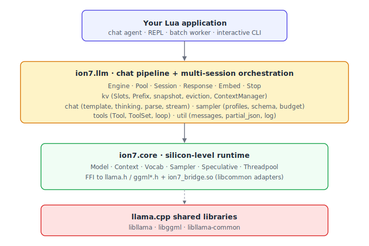

<div align="center">

# ion7-llm

**Chat pipeline + multi-session inference orchestration on top of [`ion7-core`](https://github.com/Ion7-Labs/ion7-core).**

[](LICENSE)
[](https://luajit.org/)
[](https://github.com/Ion7-Labs/ion7-core)
[](tests/)



</div>

---

`ion7-core` gives you raw silicon — model loading, decode, sampler chains, KV cache primitives. `ion7-llm` is the layer between that and a working chat application : conversation state, multi-session orchestration, structured output, tool calling, embeddings.

What that buys you :

- **Multi-session correctness by default.** Per-sequence KV snapshots, per-session `n_past` bookkeeping, slot pool, prefix cache. Concurrent conversations share one context without trampling each other.
- **A real chat pipeline.** Engine + Session + ContextManager wire ion7-core's `Vocab`, `Context`, `Sampler` and the chat-template bridge into one call : `engine:chat(session)` or `engine:stream(session)`.
- **Modern features wired up.** Interleaved-thinking-aware tool loop, four-channel streaming (`content` / `thinking` / `tool_call_delta` / `tool_call_done`), reasoning budget, parallel pool inference, RadixAttention exact-match prefix cache, mid-generation eviction (sessions keep generating past `n_ctx`), Y-Token sink hook, format-aware tool-call extraction (Mistral / Qwen / Hermes), dedicated embedding pipeline.
- **Sane separation of concerns.** Structured-output (JSON Schema, regex, type-driven grammars) lives in [`ion7-grammar`](https://github.com/Ion7-Labs/ion7-grammar) ; ion7-llm consumes its `Grammar_obj` via the standard `opts.sampler` slot.
- **Library, not a server.** No HTTP, no SSE, no MCP endpoints, no CLI binary. ion7-llm is meant to be embedded in your application — drop into agent loops, REPLs, batch jobs.

## Quick taste

```lua
local ion7 = require "ion7.core"
local llm  = require "ion7.llm"

ion7.init({ log_level = 0 })

local model        = ion7.Model.load("qwen3-8b-instruct.gguf", { n_gpu_layers = 99 })
local ctx          = model:context({ n_ctx = 32768, n_seq_max = 4, kv_unified = true })
local cm, engine   = llm.pipeline(ctx, model:vocab(), { headroom = 256 })

cm:set_system("You are a concise, helpful assistant.")

local session = llm.Session.new()
session:add_user("Explain what an embedding is in one sentence.")

for chunk in engine:stream(session, { max_tokens = 128 }) do
    if     chunk.kind == "content"  then io.write(chunk.text) ; io.flush()
    elseif chunk.kind == "thinking" then io.write("\27[2m" .. chunk.text .. "\27[0m")
    elseif chunk.kind == "stop"     then io.write("\n[" .. chunk.reason .. "]\n") end
end

ion7.shutdown()
```

Nine progressive examples in [`examples/`](examples/) walk every layer — minimal chat, streaming, multi-turn KV reuse, multi-session pool, JSON-Schema-constrained output, tool calling, reasoning models, persistence, embeddings.

## What's covered

| Surface | Status | Where to look |
|---------|:------:|---------------|
| `Session` — message history + per-seq KV bookkeeping | ✅ | [`session.lua`](src/ion7/llm/session.lua), [`02_response_session.lua`](tests/02_response_session.lua) |
| `Engine:chat` — single-session pipeline + mid-gen eviction | ✅ | [`engine.lua`](src/ion7/llm/engine.lua), [`11_engine_chat.lua`](tests/11_engine_chat.lua) |
| `Engine:stream` — typed chunk iterator (content / thinking / tool_call_delta / tool_call_done / stop) | ✅ | [`12_engine_stream.lua`](tests/12_engine_stream.lua) |
| `Pool` — N concurrent sessions, one batch per tick, mid-gen eviction | ✅ | [`pool.lua`](src/ion7/llm/pool.lua), [`13_pool.lua`](tests/13_pool.lua) |
| `kv` — Slots, Prefix cache, snapshot, eviction (`message` / `fifo`) | ✅ | [`kv/`](src/ion7/llm/kv/), [`10_kv_layer.lua`](tests/10_kv_layer.lua) |
| `kv.radix` — RadixAttention exact-match prefix cache | ✅ | [`kv/radix.lua`](src/ion7/llm/kv/radix.lua), [`14_radix.lua`](tests/14_radix.lua) |
| `kv` Y-Token sink hook (`sink_fn(session)` callback) | ✅ | [`kv/init.lua`](src/ion7/llm/kv/init.lua) |
| `chat.thinking` / `chat.parse` / `chat.stream` / `chat.tool_stream` | ✅ | [`chat/`](src/ion7/llm/chat/), [`04_thinking_tools.lua`](tests/04_thinking_tools.lua) |
| Streaming tool-call delta (OpenAI / Qwen / Mistral markers) | ✅ | [`chat/tool_stream.lua`](src/ion7/llm/chat/tool_stream.lua) |
| Format-aware post-gen parse (`opts.tool_format`) | ✅ | [`chat/parse.lua`](src/ion7/llm/chat/parse.lua) |
| `sampler.profiles` — balanced / precise / creative / code / fast / thinking | ✅ | [`sampler/profiles.lua`](src/ion7/llm/sampler/profiles.lua) |
| `sampler.budget` — `<think>` block budget guard | ✅ | [`sampler/budget.lua`](src/ion7/llm/sampler/budget.lua) |
| Structured output — delegated to [`ion7-grammar`](https://github.com/Ion7-Labs/ion7-grammar) | ↗ | [`05_grammar.lua`](examples/05_grammar.lua) |
| `tools` — declarative `Tool` / `ToolSet` + interleaved-thinking loop | ✅ | [`15_tools_loop.lua`](tests/15_tools_loop.lua) |
| `Embed` — dedicated embedding pipeline, cosine similarity | ✅ | [`embed.lua`](src/ion7/llm/embed.lua), [`17_embed.lua`](tests/17_embed.lua) |
| Persistence — Session JSON + per-seq KV file save / load | ✅ | [`18_persistence.lua`](tests/18_persistence.lua) |

## Install

ion7-llm is a pure-Lua library on top of ion7-core. The fastest way :

```bash
# 1. Get a working ion7-core (CPU build is fine).
curl -L -o ion7.tgz \
  https://github.com/Ion7-Labs/ion7-core/releases/latest/download/ion7-core-linux-x86_64-cpu.tar.gz
tar xzf ion7.tgz
export ION7_CORE=$PWD/ion7-core-*/

# 2. Drop ion7-llm next to it.
git clone https://github.com/Ion7-Labs/ion7-llm
cd ion7-llm

# 3. Run the smoke test.
ION7_MODEL=/path/to/chat.gguf bash tests/run_all.sh
```

For luarocks, manual installs, sibling-checkout layouts and platform notes, see **[`INSTALL.md`](INSTALL.md)**.

## Compatibility

| Component  | Requirement                |
|------------|----------------------------|
| LuaJIT     | 2.1 (any post-2017 build) |
| ion7-core  | matched release |
| OS         | whatever ion7-core builds on (Linux / macOS / Windows) |
| Models     | any chat-tuned llama.cpp-supported GGUF |
| Templates  | the embedded chat template (Jinja2 via the bridge) |

## Documentation

- [`ARCHITECTURE.md`](ARCHITECTURE.md) — layered design, KV layer deep-dive, hot path, request lifecycle (four annotated diagrams)
- [`INSTALL.md`](INSTALL.md) — install paths, sibling-checkout layouts, troubleshooting
- [`examples/README.md`](examples/README.md) — guided tour of the nine example scripts

## License

[MIT](LICENSE). ion7-llm builds on [ion7-core](https://github.com/Ion7-Labs/ion7-core), itself built on [llama.cpp](https://github.com/ggml-org/llama.cpp) by Georgi Gerganov and contributors.
